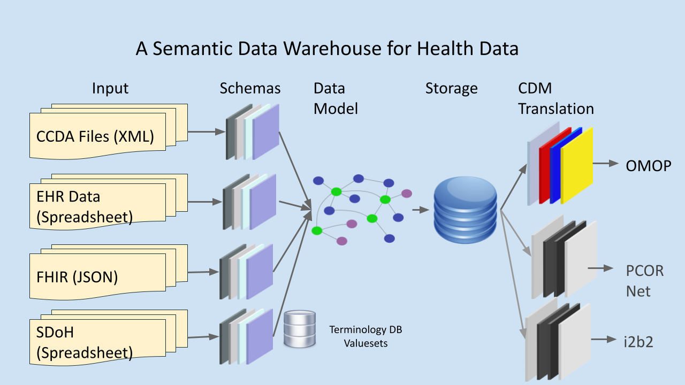

# Semantic Interoperability for Electronic Health Data Using the Layered Schemas Architecture

This repository contains the artifacts for the ONC LEAP Project titled
"Semantic Interoperability for Electronic Health Data Using the
Layered Schemas Architecture". For more information, questions, and
support, contact:

 * [DARTNet Institute](https://dartnet.info/contact.htm)
 * [Cloud Privacy Labs](https://cloudprivacylabs.com/)

The project's vision is to build an integrated ecosystem of tools and
technologies that connect and harmonize health and health-related data
obtained from organizations of all sizes, as well as individuals,
supported by a person-centric and privacy-conscious approach to data
access and sharing among patients, clinical settings, and researchers.

## Introduction

The longitudinal health data from large diverse populations with
varying social, economic, geographic, and environmental conditions is
a highly valuable resource for medical and public health researchers
through the creation of various data commons where disparate data are
structured and harmonized to expand research options. Many challenges
hinder the complete and efficient capture and exchange of health data,
including: 

  1. a lack of semantic interoperability across systems
  2. the varying adoption of data standards within and between systems 
  3. a lack of standardized metadata, and 
  4. the poor integration of electronic health records (EHR) data with data from other relevant
sources such as social services, environmental measurements,
patient-entered, and data collected from wearable devices.

EHR data can be highly variable between different sources and even
within a single EHR system, due to the differences between EHR
vendors, data models, and underlying data codification approaches; as
well as institutional conventions, and end users’ data capture
decisions amongst many other reasons. Customized
Extraction-Transformation-Loading (ETL) pipelines are the key for
semantic harmonization in a traditional data warehousing
operation. However, these data transformations are usually lossy, even
if not intended to be so, because of inexact mapping of semantics to
the target data model. The process does not scale well when numerous
data sources are involved as it requires many customizations that are
specific to a particular problem, location, and/or data source.

This project uses layered schemas as a scalable semantic harmonization
solution for data warehousing applications. Layered schemas technology
consists of a schema base that represents core attributes of the
captured data, along with multiple interchangeable overlays that
represent variations due to different EHR vendors, jurisdictions, or
organizational conventions. A layered schema also defines a mapping
between the input data elements and an abstract data model represented
as a labeled property graph. The annotated graph representation can be
transformed into a common data model or used directly, such as into a
training data set for an AI application using the source data and the
metadata associated with it.

## Layered Schemas

A **schema** is a machine-readable document that describes the
structure of data. JSON and XML schemas are widely used to generate
executable code from specifications and to check structural validity
of data. LSA extends schemas (such as FHIR or OMOP schemas) with
layers (overlays) to add semantic annotations. The semantic
annotations add ontology mappings, contextual metadata, tags, and
processing instructions that control data ingestion and
normalization. A **schema variant** is composed of a schema and a
set of overlays, and contains the combination of annotations given in
the schema and the overlays.

A schema variant is represented using a **labeled property graph**
(LPG) that has a node for each data field. An LPG is a directed graph
where every node and edge contain a set of **labels** describing its
type or class, and a set of **properties** that represent named
values. An LPG allows assigning tags that represent different types of
metadata to fields. A field may be a simple value, a structured object
(e.g a JSON object, array, polymorphic object), or a reference to
another schema.

Different schema variants can be used to ingest data that shows
variations based on data source. Data variations can be structural
(e.g. additional data fields, extensions) or semantic
(e.g. measurements in different units, different ontologies or coding
systems), and can be due to different vendor implementations, local
conventions, or regulations. Ingesting structured data using a schema
variant creates an LPG whose nodes combine the annotations from the
schema variant and data values from the input.

## Technical Overview

## Acknowledgments

This project is supported by the Office of the National Coordinator
for Health Information Technology (ONC) of the U.S. Department of
Health and Human Services (HHS) under grant number 90AX0034, Semantic
Interoperability for Electronic Health Data Using the Layered Schemas
Architecture, total award $999,990 with 100% financed with federal
dollars and 0% financed with non-governmental sources. This
information or content and conclusions are those of the author and
should not be construed as the official position or policy of, nor
should any endorsements be inferred by ONC, HHS, of the
U.S. Government.
