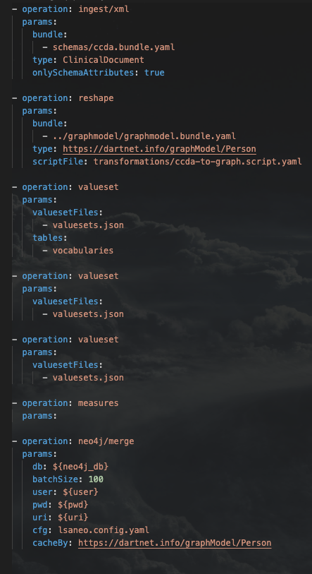
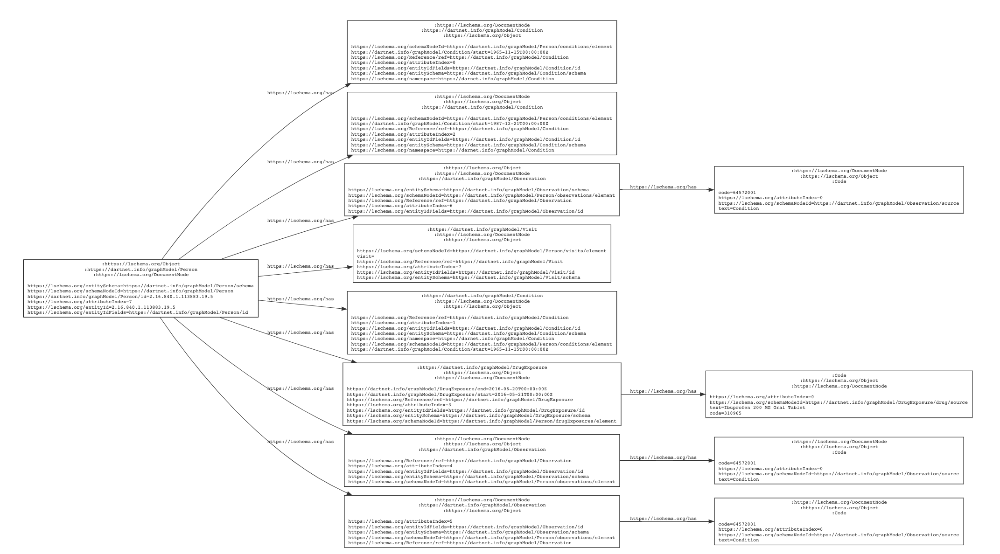
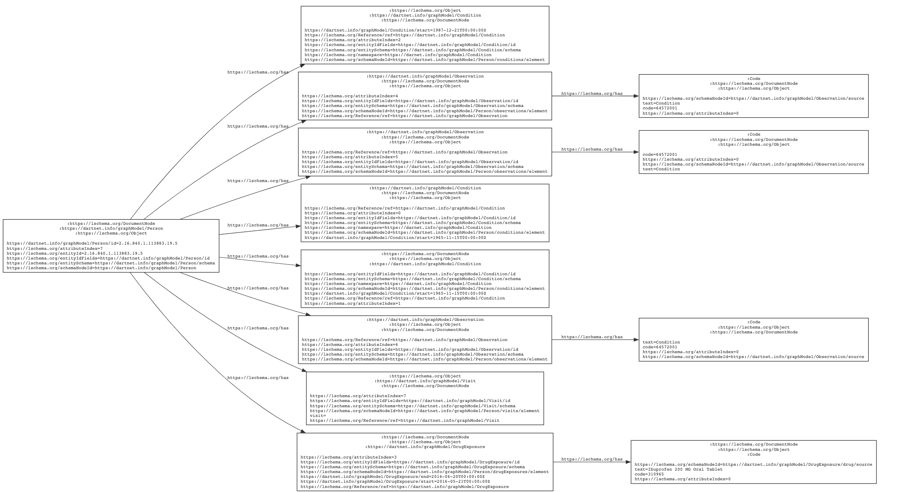

# Leading Edge Acceleration Projects (LEAP)
## _Guide To Using [Layered Schemas Architecture (LSA)](https://github.com/cloudprivacylabs.com/lsa)_
https://github.com/cloudprivacylabs.com/lsa

## Goal:
By the end of this tutorial, you will have an understanding of what Layered Schemas Architecture (LSA) is and how to use its technology given an _OMOP_ concept. For our example, we will be using the [__OMOP__](https://www.ohdsi.org/data-standardization/) concepts dataset - you can find all OMOP concepts here: https://athena.ohdsi.org/search-terms/start

## Prerequisites:
### If you do not have the following databases installed below, follow the direct page's instructions to set them up.
- [`PostgreSQL`](https://www.postgresql.org/)
-- This tutorial uses PostgreSQL, but can be extended to use any other database
- [`Neo4j`](https://neo4j.com/)
- [`Layered Schema Architecture`](https://github.com/cloudprivacylabs.com/lsa)
    - install or build binary
- [`LSA Neo4j`](https://github.com/cloudprivacylabs.com/lsa-neo4j)
    - install or build binary

## Setting Up:
Now that you have both databases installed on your machine, let's first download the dataset you wish to use from https://athena.ohdsi.org/vocabulary/list. Once that is downloaded, the next step is to import that valueset into PostgreSQL (or your RDBMS of choice). 

## Importing Concepts to PostgreSQL
The first step to importing data to our database is creating the matching columns of our downloaded valueset.
Go to https://athena.ohdsi.org/search-terms/start site and click on the domain dataset of your choice. After clicking on the domain, click on any row - this should bring you to a page that looks the following:


In this picture, the details list for the drug Promedrol are composed of the rows:
- Domain ID
- Concept Class ID
- Vocabulary ID
- Concept ID
- Concept code
- Validity
- Concept
- Valid start
- Valid end

In PostgreSQL, we must create a table with columns that match the rows of our concepts.
```
CREATE TABLE concepts (
    concept_id VARCHAR(55) UNIQUE,
    concept_name VARCHAR(255),    
    domain_id VARCHAR(55),
    vocabulary_id VARCHAR(255),
    concept_class_id VARCHAR(255),
    standard_concept VARCHAR(55),
    concept_code VARCHAR(55),
    valid_start_date VARCHAR(255),
    valid_end_date VARCHAR(255),
    invalid_reason VARCHAR(100)
)
```

To import your concepts CSV file into the `concepts` table, you use the `COPY` statement as follows:
```
COPY persons(first_name, last_name, dob, email)
FROM 'relative/path/concepts.csv'
DELIMITER ','
CSV HEADER;
```

With this you should have the concepts set into PostgreSQL. 
Next up, we will go through the steps to process a _CCDA_ code using XML data. 

# Concept Processing Steps

## Definitions:
- Pipeline
    - Pipeline defines the steps of the data processing. 
- Bundle
    - Bundle defines type names for schema variants so references can be resolved. 
- Ingest
    - Ingestion is the processing of structured data (in JSON, XML, CSV, etc.) using a layered schema which produces a labeled property graph by combining schema information with the input data elements. The resulting graph is self-contained, and includes both the input data and the schema.
- Reshape
    - Reshaping takes the graph produced from ingestion, a script file, an output schema and creates another graph using the definitions of the output schema.
- Valueset
    - Value sets and dictionaries are used to assign normalized values to input data that may come in different variations. A value set can be used to map a set of values to a predefined set of normalized values.

# CCDA Code Processing Steps:
## Creating a Pipeline YAML file
Create a YAML file that will be used for the pipeline steps:
```
touch bundle-to-gm.pipeline.yaml
```

Here is a sample of a pipeline file:




Listed you can see the pipeline has a list of steps under the `operation` key. You can find the full list of operations in the [lsa](https://github.com/cloudprivacylabs.com/lsa) and [lsa-neo4j](https://github.com/cloudprivacylabs.com/lsa-neo4j) repositories.

#

## Ingestion
Under the first operation `ingest/xml`, you can see that the input to the bundle is a CCDA Bundle stored in a XML file.

The first step is the ingestion of the XML file using the CCDA schema. At this stage, this will produce a graph that looks like the XML structure.

To run all the steps of the pipeline, use the `pipeline` command from the LSA binary along with the XML file and pipeline file.
```
pipeline bundle-to-gm.pipeline.yaml your_filename.XML
```
The operation of `ingest/xml` will take the XML file and combine it with the schema information passed by the bundle. Behind the scenes, the output graph will look something like this:

#
Zoomed in graph, focusing on the _Patient_ node.


## Reshape
The next step of the pipeline operations is `reshape` which will take the ingested graph, a different bundle which describes the next structure of how the ingested graph should be conformed to, and a transformation script which details the queries used to map the ingested graph to the definitions of the bundle schemas.

After reshape the graph looks like this:

#

>Take note of the differences in shape and properties from ingested graph to the reshaped graph.
When running the `reshape` operation, the separate bundle _(graphmodel.bundle.yaml)_ that was listed in the pipeline file defined how the nodes from the ingested graph were mapped onto a new graph.

Following reshape, the next step listed in our pipeline file is operation `valueset`. This operation passes a valueset file(s) which specifies an optional list of lookup tables and key-value pairs to lookup in our PostgreSQL database which contains our _Concepts_ data that was imported earlier. 

## Apply Valueset(s)
The graph after applying the valueset(s):


> Structure of the graph is relatively the same as it was from the reshaping step, only now that we add additional valueset nodes which contain the normalized properties


## Display Graph to Neo4j
The last step listed in our pipeline file is: `neo4j/merge` which will take our ingested and reshaped graph with all the valuesets applied and display it the Neo4j database.
To view the fully processed graph in Neo4j, run the query: 
```
MATCH (n) RETURN n
```


We have walked through and completed all the steps described by the pipeline file in processing a _CCDA_ code using the LSA binary. With this you should have a better understanding of how to process not just any _CCDA_ codes or any XML files, but with dissimilar data standard as well as different data formatting i.e. `HL7` standards with CSV files.

Feel free to explore more about [_Layered Schemas Archictecture_](https://github.com/cloudprivacylabs.com/lsa) and its other capabilities in the Github repository.

